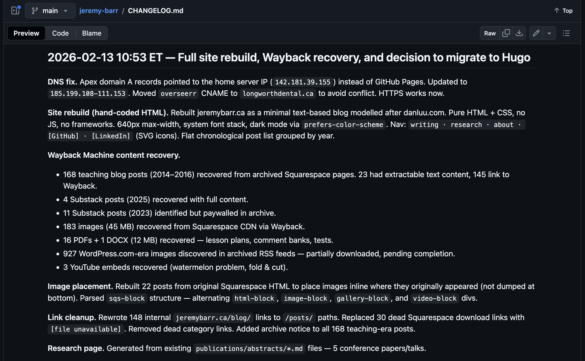
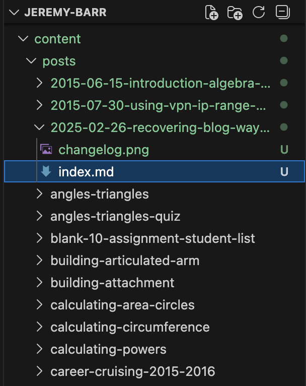

I've put up about 3 or 4 different blogs at jeremybarr.ca over the years. I've used WordPress, Squarespace, and Substack. And each time I've migrated to the new one, I've sworn that I'll put up the old posts, which of course never ends up happening.

With the advent of the web getting turned over to AI agents, my first reaction was to be okay just dropping the entire thing. Why even put up my own stuff if it's just going to be absorbed into training data and then regurgitated anyway? I've moved through the different processes of using AI for coding. Asking questions in the UI, copy-pasting examples back-and-forth. Trying Claude Code supervised on my computer. Trying out orchestration: an agent managing other agents. And for the last few months, [coding in a custom harness](https://pi.dev/).

So, why bring back the blog from the [Wayback Machine](http://search.archive.org/)? I'm at a point with this whole AI thing that I value human-written content more than ever. I love documentation sites, where I can read something and know that a human has spent time accurately writing how the thing works. It's not just a bunch of random instructions that change from one moment to the next. And while I don't think my own writing often hits that level of usefulness, there are definitely old math assessments and blog posts here that could be useful to some people, some of the time.

If you look through the [GitHub history for this repo](https://github.com/jeremyoftheberemies/jeremy-barr), you're going to notice a whole bunch of essentially vibe-coded commits, finding all of the old blog posts. You can tell that Claude wrote the commits, because it's just so verbose. And it sort of misses the point: it has trouble figuring out what is important and what's not, what actually happened and in what order.

Like so many things with using a coding agent, by the time I go through and check all of this work, I probably could have done it all myself. I'm at a point where probably 80% of the content is up. But now I need to go through and map it all. My process is to go through each post one-by-one, and prefix each title with the date, check it fully (did the text and images copy over correctly? is the date correct?), and move on to the next one. It's the only way I'll know for sure that it's been moved.

Where I've had the most luck in this migration is in getting Claude to check my work. For example, in this [Angles & Triangles](/posts/2015-05-15-angles-triangles/) unit, the original Wayback Machine page only shows some of the PDF pages. So I assumed that when I uploaded the images originally, I had skipped some. Turns out, Claude noticed that the HTML references 17 images, and the PDF has (you guessed it!) 17 images. So, even though not all images were archived on the Wayback Machine, I was still able to regenerate them from the PDF.

